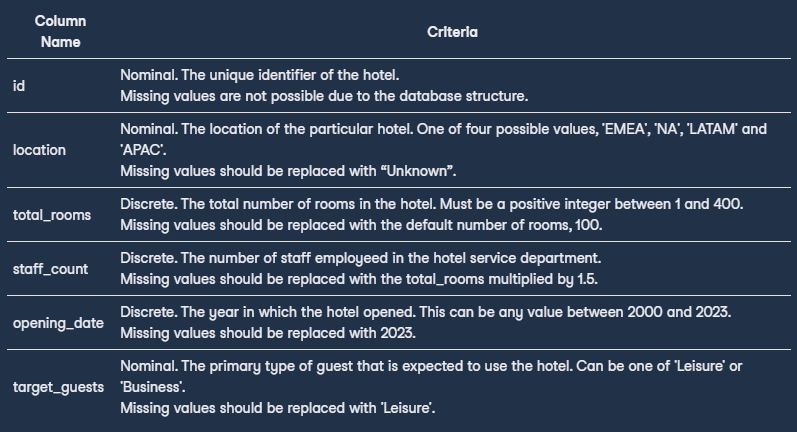

# Practical Exam: Hotel Operations

LuxurStay Hotels is a major, international chain of hotels. They offer hotels for both business and leisure travellers in major cities across the world. The chain prides themselves on the level of customer service that they offer.

However, the management has been receiving complaints about slow room service in some hotel branches. As these complaints are impacting the customer satisfaction rates, it has become a serious issue. Recent data shows that customer satisfaction has dropped from the 4.5 rating that they expect.

You are working with the Head of Operations to identify possible causes and hotel branches with the worst problems.

## Data

The following schema diagram shows the tables available. You have only been provided with data where customers provided a feedback rating.

## Task 1

Before you can start any analysis, you need to confirm that the data is accurate and reflects what you expect to see.

It is known that there are some issues with the `branch` table, and the data team have provided the following data description.

Write a query to return data matching this description, including identifying and cleaning all invalid values. You must match all column names and description criteria. Your output should be a DataFrame named `clean_branch_data`.

## Task 2

The Head of Operations wants to know whether there is a difference in time taken to respond to a customer request in each hotel. They already know that different services take different lengths of time.

Calculate the average and maximum duration for each branch and service.

- Your output should be a DataFrame named `average_time_service`
- It should include the columns `service_id`, `branch_id`, `avg_time_taken` and `max_time_taken`
- Values should be rounded to two decimal places where appropriate.

## Task 3

The management team want to target improvements in Meal and Laundry service in Europe (EMEA) and Latin America (LATAM).

Write a query to return the description of the service, the id and location of the branch, the id of the request as `request_id` and the rating for the services and locations of interest to the management team.

Your output should be a DataFrame named `target_hotels`.

Use the original `branch` table, not the output of Task 1.

## Task 4

So that you can take a more detailed look at the lowest performing hotels, you want to get service and branch information where the average rating for the branch and service combination is lower than 4.5 — the target set by management.

- Your output should be a DataFrame named `average_rating`
- It should return the `service_id` and `branch_id`, and the average rating (`avg_rating`)
- Values should be rounded to 2 decimal places where appropriate.
